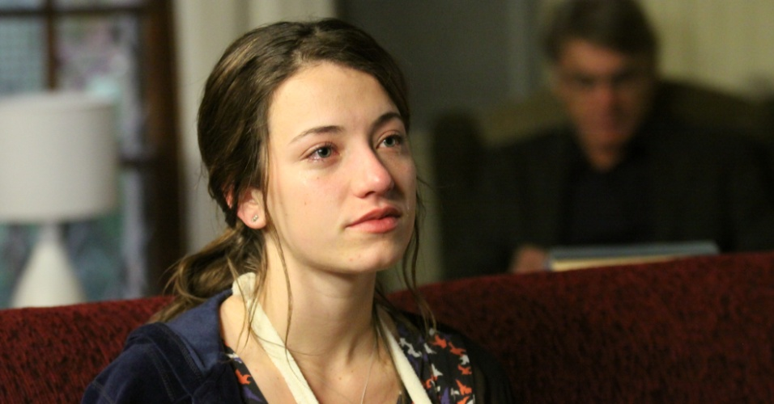

:source-highlighter: pygments
:imagesdir: imagens
:toc: left

= Trabalhos de PDI
Andrés Alvarado <andresaar94@gmail.com>

== Exercicio 2.2

Para estas atividades foi utilizada a seguinte imagem, carregada apenas em tom de cinza:

.nina.jpg

=== regions.py

[source,python]
----
include::programas/regions.py[]
----

==== Explicando o codigo

[source,python]
----
include::programas/regions.py[lines=5..18]
----

Esta função serve para pegar os valores em (x,y) dos pontos onde o mouse aperta e posteriormente solta encima da tela e salvá-los em um vetor, que será a região onde será aplicado o negativo.

[source,python]
----
include::programas/regions.py[lines=20..23]
----

A imagem é carregada como tons de cinza e é feita a ligação do evento do mouse com a função *click_and_crop*.

[source,python]
----
include::programas/regions.py[lines=25..38]
----

Ao criar uma área com o mouse, os pixels dentro dessa area serão substituidos com 255 menos o valor original, criando assim o negativo nesta região. Se após criado o negativo for apertada a tecla *z*, o programa é fechado. Caso contrario, será carregada novamente a imagem e o programa esperara mais uma região para negativo.

.Aplicado o negativo
image::nina_neg.jpg[]

=== trocaregioes.py

[source,python]
----
include::programas/trocaregioes.py[]
----

==== Explicando o codigo

[source,python]
----
include::programas/trocaregioes.py[lines=4..7]
----

A imagem é carregada como tons de cinza e pegam-se seus valores de altura e largura, depois é esperado o apertar de alguma tecla.

[source,python]
----
include::programas/trocaregioes.py[lines=10..15]
----

A imagem é dividida horizontalmente em duas imagens na metade da altura, e depois concatenadas na ordem contraria. O mesmo é feito novamente mas no sentido vertical com metade da largura da imagem.

.Aplicado o programa
image::nina_troca.jpg[]
